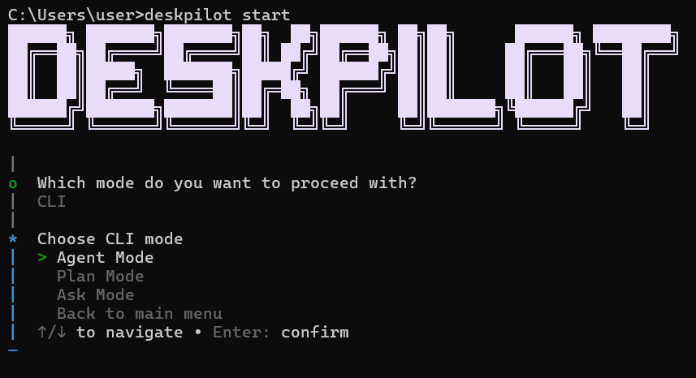

# DeskPilot

DeskPilot is a Bun-based command-line assistant that helps you interact with and modify a codebase using three coordinated flows: Ask, Plan, and Agent. It also supports a Telegram bot for remote control of the same workflows.

<p align="center">
  
</p>


## Table of contents

- Project overview
- Quickstart
- Configuration
- Usage examples
- Architecture & file layout
- Development
- Contributing
- Troubleshooting

## Project overview

DeskPilot provides:

- Interactive CLI launcher with a mode picker and rich terminal UI
- "Ask" mode to query the workspace or models for information
- "Plan" mode to generate and select step-by-step tasks
- "Agent" mode to run automated changes with staged approvals
- Optional Telegram bot for remote operation and integration with messaging workflows

The project is designed for safety: code edits are staged and require explicit approval before being applied.

## Quickstart

Prerequisites

- Bun (https://bun.sh) installed and available on your PATH
- An OpenRouter API key and model name for AI features

Install dependencies

```bash
bun install
```

Run the interactive launcher

```bash
bun run index.ts start
```

Show help

```bash
bun run index.ts --help
```

## Configuration

Create a `.env` file in the project root or export these environment variables in your shell.

Required

```bash
OPENROUTER_API_KEY=your_openrouter_key
OPENROUTER_DEFAULT_MODEL=your_model_name
```

Optional

```bash
FIRECRAWL_API_KEY=your_firecrawl_key
TELEGRAM_BOT_TOKEN=your_telegram_bot_token
TELEGRAM_OWNER_ID=your_telegram_numeric_user_id
```

- `TELEGRAM_OWNER_ID` restricts bot commands to the configured owner account.

## Usage examples

- Start the launcher and pick a mode: `bun run index.ts start`
- Ask a question from CLI: follow prompts in Ask mode to query the workspace or model
- Create a plan: use Plan mode to generate steps and optionally execute selected steps
- Run an agent task: Agent mode stages file edits and opens an approval flow before applying changes

Telegram

When configured, the Telegram bot exposes these commands to the owner:

- `/ask <question>` — ask the model about the repository
- `/plan <goal>` — generate a plan for a goal
- `/agent <task>` — run an agent task (edits are still staged for approval)

## Architecture & file layout

Key entry points and directories

- `index.ts` — CLI entrypoint and launcher
- `ai/` — model provider and AI wiring (`ai.config.ts`, `index.ts`)
- `tui/` — terminal UI and banner (`runStart.ts`, `terminal-md.ts`)
- `modes/` — contains mode orchestrators and handlers
	- `modes/cli.ts` — routes between Ask, Plan, and Agent
	- `modes/agent/` — staged edits, approvals, tool execution
	- `modes/plan/` — planning, step generation, selection
	- `modes/telegram/` — Telegram bot handlers and sessions

Design notes

- All file edits produced by automated flows are staged first and presented for human approval.
- The codebase is organized to separate orchestration (modes) from tooling and AI integration (ai/ and tool modules).

## Development

Run the project locally with Bun as shown in Quickstart. For iterative development:

1. Update source files.
2. Run the launcher to exercise modes and flows.

If you add tooling or tests, include their run instructions here.

## Contributing

Contributions are welcome. Please open issues or pull requests with a clear description of the change and motivation. When proposing changes that modify files, prefer small, focused PRs and explain how to exercise the change locally.

## Troubleshooting

- If the CLI fails to start, ensure Bun is installed and `bun install` completed successfully.
- If AI features fail, confirm `OPENROUTER_API_KEY` and `OPENROUTER_DEFAULT_MODEL` are set and valid.
- For Telegram issues, verify `TELEGRAM_BOT_TOKEN` and `TELEGRAM_OWNER_ID` are correct and the bot is enabled.
